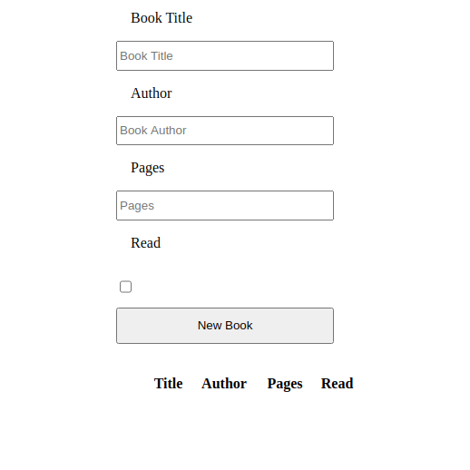

# Library



> The main objective for this application is to test the ability to use object constructors and to do some DOM manipulation.


## Built With

- HTML
- CSS
- JavaScript

## Live Demo

[Live Demo]()


### Getting Started
```
Open Terminal
run git clone `git@github.com:sanadwj/library.git`
Run `index.html` in your favorite browser.
```


### Deployment

This project has been deployed on Netlify.


## Authors

👤 **Kelyn Paul Njeri**

- Github: [@KelynPNjeri](https://github.com/KelynPNjeri)
- LinkedIn: [KelynNjeri](https://www.linkedin.com/in/kelyn-paul/)

👤 **Sanad Abujbara**

- Github: [@sanadwj](https://github.com/sanadwj)
- Twitter: [@sandooog](https://twitter.com/sandooog)
- Linkedin: [sanad-abujbara](https://linkedin.com/in/sanad-abujbara)
- Portifolio: [sanadabujbara.tech](https://sanadabujbara.tech)

## 🤝 Contributing

Contributions, issues and feature requests are welcome!

## Show your support

Give a ⭐️ if you like this project!

## Acknowledgments

- Microverse
- GitHub
- TheOdinProject
- JavaScript

